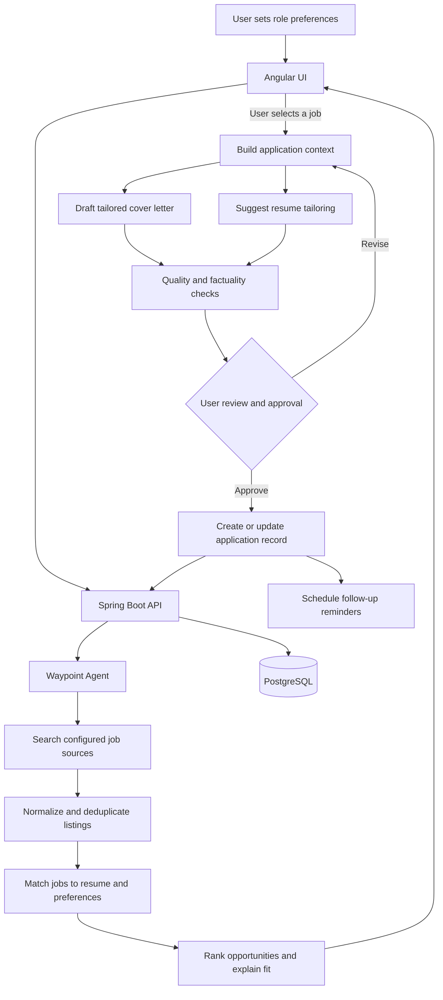

# WayPoint

WayPoint is a job application tracker for keeping a job search organised in one place. It helps you record companies, contacts, applications, resumes, interview progress, and follow-up information instead of spreading those details across notes, spreadsheets, and email.

The project has three parts:

- `waypoint`: a Spring Boot REST API backed by PostgreSQL.
- `ui/waypoint-ui`: an Angular web application that consumes the API.
- `waypoint-agent`: the AI orchestration service for job discovery, matching, and tailored application materials.

## Main features

### Company management

Store the companies you are applying to, including their website, industry, and notes. Companies are the parent records used by applications and contacts.

### Job application tracking

Create an application for a company and keep its position, location, work mode, salary range, application dates, job link, resume, and notes together. Applications can be filtered by stage.

Supported stages are `APPLIED`, `OA`, `INTERVIEW`, `OFFER`, `REJECTED`, `WITHDRAWN`, and `GHOSTED`.

Changing an application's stage also records stage history, which preserves the progress of the application over time.

### Contact management

Keep recruiter and employee contact details connected to a company. Contacts can be listed for a specific company or retrieved individually.

### Resume management

Save the resumes used during a job search and associate a resume with an application. The API supports creating, listing, viewing, and deleting resumes.

### Dashboard and reminders

The Angular interface includes dashboard and reminder services for summary information, weekly application counts, resume performance, and follow-ups. These are part of the planned API surface and should be treated as incomplete until their backend controllers are available.

### Waypoint Agent

The planned agent works behind the application to discover suitable jobs, compare them with a selected resume, and draft tailored cover letters. Recommendations and generated documents are presented to the user for review; the agent must not submit an application without explicit approval.



More detailed boundaries and the proposed internal workflow are documented in [`waypoint-agent/README.md`](waypoint-agent/README.md).

## API endpoints

The backend runs at `http://localhost:8080` by default. All endpoint paths below are relative to that address and return JSON unless stated otherwise. IDs are UUIDs.

### Companies

| Method | Endpoint | Purpose |
| --- | --- | --- |
| `POST` | `/api/companies` | Create a company. `name` is required. |
| `GET` | `/api/companies` | List all companies. |
| `GET` | `/api/companies/{id}` | Get one company. |
| `PUT` | `/api/companies/{id}` | Replace a company's details. `name` is required. |
| `DELETE` | `/api/companies/{id}` | Delete a company. Returns `204 No Content`. |

### Applications

| Method | Endpoint | Purpose |
| --- | --- | --- |
| `POST` | `/api/applications` | Create an application. `companyId` and `position` are required. |
| `GET` | `/api/applications` | List applications. Use `?stage=INTERVIEW` to filter by stage. |
| `GET` | `/api/applications/{id}` | Get one application. |
| `PATCH` | `/api/applications/{id}/stage` | Change the stage and optionally add notes. This creates stage history. |
| `DELETE` | `/api/applications/{id}` | Delete an application. Returns `204 No Content`. |

### Contacts

| Method | Endpoint | Purpose |
| --- | --- | --- |
| `POST` | `/api/contacts` | Create a contact. |
| `GET` | `/api/contacts?companyId={companyId}` | List contacts for a company. |
| `GET` | `/api/contacts/{id}` | Get one contact. |
| `DELETE` | `/api/contacts/{id}` | Delete a contact. Returns `204 No Content`. |

### Resumes

| Method | Endpoint | Purpose |
| --- | --- | --- |
| `POST` | `/api/resumes` | Create a resume record. |
| `GET` | `/api/resumes` | List resumes. |
| `GET` | `/api/resumes/{id}` | Get one resume. |
| `DELETE` | `/api/resumes/{id}` | Delete a resume. Returns `204 No Content`. |

Send request bodies as JSON with the `Content-Type: application/json` header. Validation errors and missing records are handled by the backend's common exception handler.

## Local setup

### Requirements

- Java 26
- Maven, or the included Maven wrapper
- Node.js and npm
- PostgreSQL

### Start the backend

Create `waypoint/.env` or export these variables in your shell:

```bash
DB_URL=jdbc:postgresql://localhost:5432/waypoint
DB_USERNAME=your_database_user
DB_PASSWORD=your_database_password
```

Then run:

```bash
cd waypoint
set -a
source .env
set +a
./mvnw spring-boot:run
```

Flyway applies the database migrations from `waypoint/src/main/resources/db/migration`. The API is available at `http://localhost:8080`.

### Start the frontend

In a second terminal, run:

```bash
cd ui/waypoint-ui
npm install
npm start
```

Open `http://localhost:4200`. The development API base URL is configured in `src/environments/environment.ts`.

## Testing and building

Backend tests and packaging:

```bash
cd waypoint
./mvnw test
./mvnw package
```

Frontend tests and production build:

```bash
cd ui/waypoint-ui
npm test
npm run build
```

## Security note

Development security currently permits API requests so the frontend and tools such as Postman can be used locally. Authentication and authorisation must be added before deploying WayPoint to a shared or public environment.

## Project structure

```text
waypoint/                 Spring Boot API and database migrations
ui/waypoint-ui/           Angular frontend
waypoint-agent/           AI job-search and document-generation service
waypoint/src/main/java/   Backend domain, service, and controller code
waypoint/src/main/resources/db/migration/
                          Flyway database migrations
```

By Darlene Wendy
